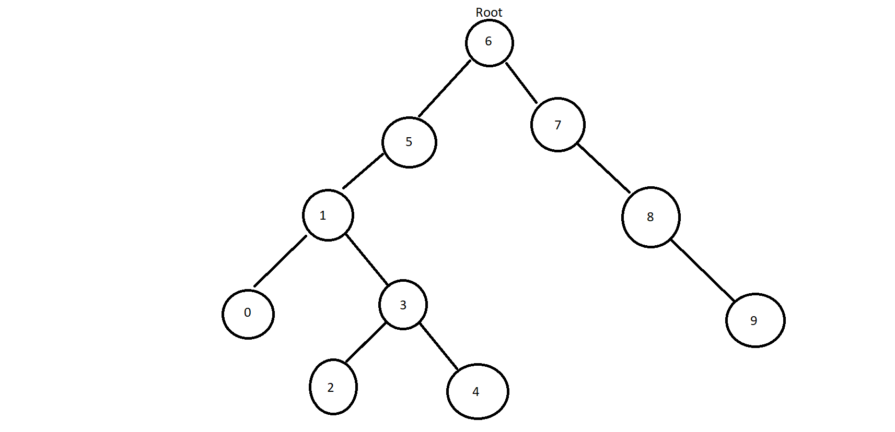

## [7, 5, 1, 8, 3, 6, 0, 9, 4, 2] dizisinin Binary-Search-Tree aşamalarını yazınız.
- Root 6 dır.
- 7 6 dan büyük bir değer olduğu için 6 nın sağında yeralır.
- 5 6 dan küçük bir değer olduğu için 6 nın solunda yer alır.
- 1 6 dan ve 5 den küçük bir değer olduğu için 5 in solunda yer alır.
- 8 6 dan ve 7 den büyük bir değer olduğu için 7 nin sağında yer alır.
- 3 6 dan ve 5 den küçük olduğu için 5 in solunda 1 den büyük olduğu için 1 in sağında yer alır.
- 0 6 dan 5 den ve 1 den küçük olduğu 1 in solunda yer alır.
- 9 6 dan 7 den ve 8 den büyük olduğu için 8 in sağında yeer alır.
- 4 6 dan ve 5 den küçük olduğu ve 1 den ve 3 den büyük olduğu için 3 ün sağında yer alır.
- 2 6dan  5 den ve 3 den küçük olduğu ve 1 den büyük olduğundan dolayı 3 ün solunda yer alır.
